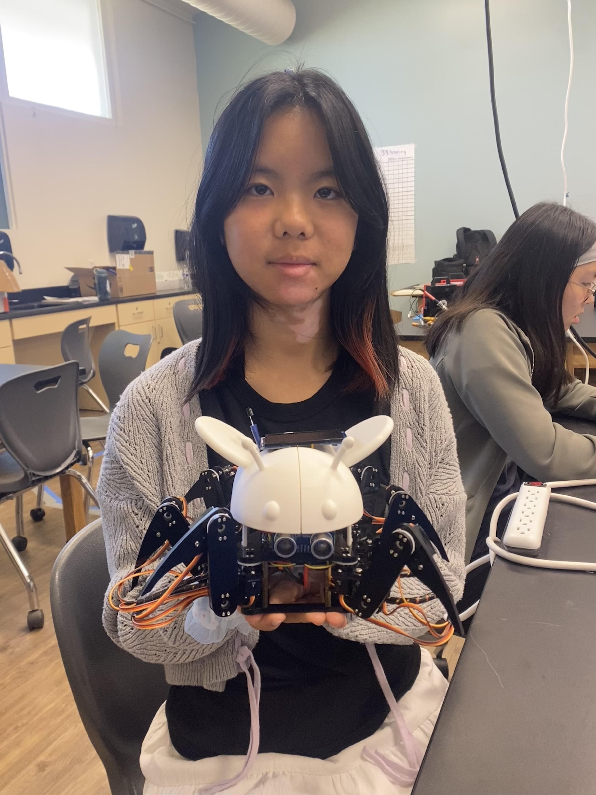
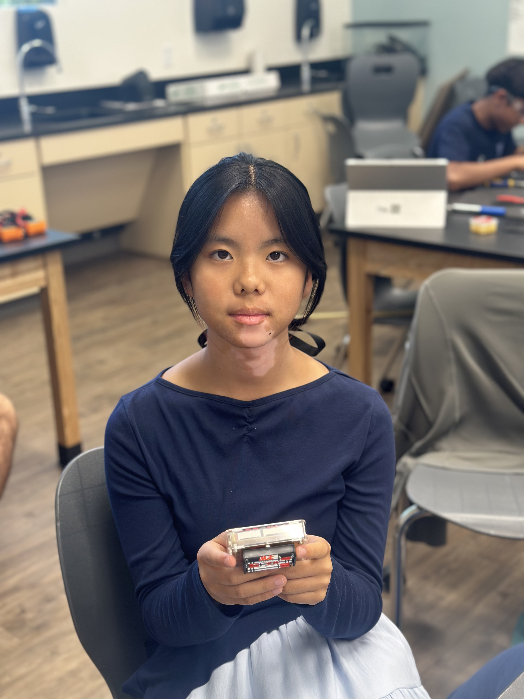

# Hexabee

The Hexabee is a modified version of the Freenove Hexapod Robot. It is a six legged robot designed to move and look similar to a bee. Each leg is made up of three servos which can be controlled through a computer program, an iphone app, or a physical remote control. The body of the Hexabee is a 3d printed bee modeled using CAD. It's capable of displaying the distance of any obstacles it detects through the ultrasonic sensor and the current humidity and temperature through the DHT11 sensor.

| **Engineer** | **School** | **Area of Interest** | **Grade** |
|:--:|:--:|:--:|:--:|
| Alice L. | Lynbrook High School | TBD | Incoming Sophmore


  
# Final Milestone

<iframe width="560" height="315" src="https://www.youtube.com/embed/IYq5nveivSs?si=xY_JI1r71WWYH0K6" title="YouTube video player" frameborder="0" allow="accelerometer; autoplay; clipboard-write; encrypted-media; gyroscope; picture-in-picture; web-share" referrerpolicy="strict-origin-when-cross-origin" allowfullscreen></iframe>

### Description
### Challenges
### Next Step


# Second Milestone

<iframe width="560" height="315" src="https://www.youtube.com/embed/AfRUrXuUrDk?si=9Ig_jzEa9r7GMSKy" title="YouTube video player" frameborder="0" allow="accelerometer; autoplay; clipboard-write; encrypted-media; gyroscope; picture-in-picture; web-share" referrerpolicy="strict-origin-when-cross-origin" allowfullscreen></iframe>

### Description
### Challenges
### Next Step

# First Milestone

<iframe width="560" height="315" src="https://www.youtube.com/embed/Yec_EKpSPK0?si=HAmwGK7f6RO3Eiup" title="YouTube video player" frameborder="0" allow="accelerometer; autoplay; clipboard-write; encrypted-media; gyroscope; picture-in-picture; web-share" referrerpolicy="strict-origin-when-cross-origin" allowfullscreen></iframe>

### Description
By following the set of instructions that came with the Freenove Hexapod Robot, I was able to complete the assembly and calibration for the body, legs, and servos of the robot and set up the Arduino IDE and the Processing software. Before assembling everything, I had to remove the battery case, as the original kit required a lithium battery, which apparently  are more prone to explode, so we replaced it with nickel metal hydride batteries. To connect the new battery, I had to solder in screw terminals to fasten more wires. The kit already came with prewritten code for the Freenove Hexapod Robot library, so all I had to do was upload the example codes to my robot. The Processing software was used to run the prewritten computer program that would be used to calibrate and control my robot through a USB cable or Wi-Fi module. I also set up the physical remote control that is connected to the hexapod through a wireless module. 

<video width="640" height="360" controls>
  <source src="HexapodVid.mp4" type="video/mp4">
  Your browser does not support the video tag.
</video>

### Challenges
I faced a series of challenges, including desoldering the battery case, calibrating the servos, and overall, just the tedious process of assembling the hexapod. The first challenge I was met with was desoldering the battery case, which had to be done before assembling the rest of the robot. With the help of an instructor, I was able to rotate between soldering each of the ix pin and trying to wiggle them out one at a time.  

### Next Step
I plan on CADing another battery case to hold my new nickel metal hydride battery because I currently have no where to house it. To make it fun, I plan on making it look like some sort of cute insect like a bee. I also plan on adding more electronics for it to be able to interact more with its environment. 

# Starter Project Milestone

## Retro Arcade Console

<iframe width="560" height="315" src="https://www.youtube.com/embed/C0KbTLukOyM?si=TB4xxQ1_YjlOvbIA" title="YouTube video player" frameborder="0" allow="accelerometer; autoplay; clipboard-write; encrypted-media; gyroscope; picture-in-picture; web-share" referrerpolicy="strict-origin-when-cross-origin" allowfullscreen></iframe>

### Description

Before the main project, we had to work on a starter project. Mine was the retro arcade consol which had a tedious amount of soldering pins and wires. I started out by soldering on the buttons and displays, which wasn't the most difficult. The real challenge was getting Hershey's Kisses-shaped solder joints and waiting for the solder to heat up, which felt longer than the actual soldering process itself. I then had to solder all the wires on to connect the battery case to the board and finished by assembling the case. 



### Challenges

The project itself was quite straightforward, until I realized I had soldered on the 6 pin component on the wrong way. I then proceeded to spend the next half an hour struggling to desolder this component turning my board into a burnt mess. However, I did learn of many disoldering ways including the solder sucker, solder wick, and as a last resort, brute forcing it out. Eventually, by using numerous disoldering techniques, I was able to remove the component, which was beyond usable at that point. I replaced it with a new one and made sure that I wouldn't make the same mistake soldering it on again.

### Next Step

Once I finished the starter project, I would be able to move onto my main project, the Hexapod, where I would learn more skills and come across even more difficult challenges.

# Schematics 
Here's where you'll put images of your schematics. [Tinkercad](https://www.tinkercad.com/blog/official-guide-to-tinkercad-circuits) and [Fritzing](https://fritzing.org/learning/) are both great resoruces to create professional schematic diagrams, though BSE recommends Tinkercad becuase it can be done easily and for free in the browser. 

# Code
Github Repository to entire Hexabee Source Code : [HexabeeSourceCode](https://github.com/orangelice/HexabeeSourceCode.git)

### Arduino IDE Code

```c++
#define IR_REMOTE_ENABLE_TOTAL_NO_WARNINGS
#include <Wire.h>
#include <Adafruit_SSD1306.h>
#include <Adafruit_GFX.h>
#include <Arduino.h>
#define IR_USE_AVR_TIMER3
#include <IRremote.hpp>
#include <FNHR.h>

#include "DHT.h"
#include "FNHRDisplay.h"
#define DHTPIN 3 // Defining the data output pin to Arduino
#define IR_RECEIVE_PIN 2
#define DHTTYPE DHT11 // Specify the sensor type(DHT11 or DHT22)
#define OLED_ADDR   0x3C // OLED display TWI address

FNHR robot;
DHT dht(DHTPIN, DHTTYPE); 

Adafruit_SSD1306 display(-1);

#ifndef ARDUINO_AVR_MEGA2560
#error Wrong board. Please choose "Arduino/Genuino Mega or Mega 2560"
#endif

#if (SSD1306_LCDHEIGHT != 64)
#error("Height incorrect, please fix Adafruit_SSD1306.h!");
#endif  

void setup() {
  robot.Start(true);
  Serial.begin(115200);
  dht.begin();
  IrReceiver.begin(IR_RECEIVE_PIN, ENABLE_LED_FEEDBACK);
  setupSensorsAndDisplay();

  // initialize and clear display
  display.begin(SSD1306_SWITCHCAPVCC, OLED_ADDR);
  display.setTextColor(SSD1306_WHITE);
  Wire.begin();
  Wire.setClock(400000L); 
  display.clearDisplay();
}

void loop() {

  if (IrReceiver.decode()) {
      unsigned long command = IrReceiver.decodedIRData.command;
      
      // Update screen state based on button press
      switch (command) {
        case 0x0C: // HEX code for Button 1
          currentScreen = SCREEN_ULTRASONIC;
          break;
        case 0x18: // HEX code for Button 2
          currentScreen = SCREEN_DHT;
          break;
        case 0x45: // HEX code for Power Button
          currentScreen = SCREEN_OFF;
          break;
      }
    
    IrReceiver.resume();
  }
  robot.Update();
  updateActiveScreen();
}    
```
### Modified Crawl Function in FNHRBasic.cpp
```c++
void RobotAction::Crawl(float x, float y, float angle)
{
  // Serial.println("Crawl");
  const int trigPin = A1;
  const int echoPin = A0;

  pinMode(trigPin, OUTPUT);
  pinMode(echoPin, INPUT);

  float duration, distance, stopDistanceCm=15.0;

  digitalWrite(trigPin, LOW);
  delayMicroseconds(2);
  digitalWrite(trigPin, HIGH);
  delayMicroseconds(10);
  digitalWrite(trigPin, LOW);

  duration = pulseIn(echoPin, HIGH);
  distance = (duration*.0343)/2;
  Serial.print("Distance: ");
  Serial.println(distance);

  // static unsigned long lastOledUpdate = millis();
  
  if (distance > stopDistanceCm) {
    ActionState();
    if (legsState != LegsState::CrawlState)
      InitialState();
    if (mode != Mode::Active)
      ActiveMode();

    float length = sqrt(pow(x, 2) + pow(y, 2));
    if (length > crawlLength)
    {
      x = x * crawlLength / length;
      y = y * crawlLength / length;
    }
    angle = constrain(angle, -turnAngle, turnAngle);

    x /= crawlSteps;
    y /= crawlSteps;
    angle /= crawlSteps;

    RobotLegsPoints points1;
    robot.GetPointsNow(points1);

    RobotLegsPoints points2 = points1;
    GetCrawlPoints(points2, Point(-x / 2, -y / 2, 0));
    GetTurnPoints(points2, -angle / 2);

    RobotLegsPoints points3 = points1;
    GetCrawlPoints(points3, Point(-x, -y, 0));
    GetTurnPoints(points3, -angle);

    RobotLegsPoints points4 = robot.bootPoints;
    GetCrawlPoints(points4, Point(x  * (crawlSteps - 1) / 2 / 2, y  * (crawlSteps - 1) / 2 / 2, -bodyLift + legLift));
    GetTurnPoints(points4, angle  * (crawlSteps - 1) / 2 / 2);

    RobotLegsPoints points5 = robot.bootPoints;
    GetCrawlPoints(points5, Point(x * (crawlSteps - 1) / 2, y  * (crawlSteps - 1) / 2, -bodyLift));
    GetTurnPoints(points5, angle  * (crawlSteps - 1) / 2);

    legMoveIndex < crawlSteps ? legMoveIndex++ : legMoveIndex = 1;

    switch (crawlSteps)
    {
    case 2:
      switch (legMoveIndex)
      {
      case 1:
        points2.leg1 = points4.leg1;
        points3.leg1 = points5.leg1;
        points2.leg3 = points4.leg3;
        points3.leg3 = points5.leg3;
        points2.leg5 = points4.leg5;
        points3.leg5 = points5.leg5;
        if (CheckCrawlPoints(points2))
        {
          if (!CheckCrawlPoints(points3))
          {
            points3 = points2;
            points3.leg1.z = points1.leg1.z;
            points3.leg3.z = points1.leg3.z;
            points3.leg5.z = points1.leg5.z;
          }
          LegsMoveTo(points2, 1, legLiftSpeed);
          LegsMoveTo(points3, 1, legLiftSpeed);
        }
        break;
      case 2:
        points2.leg2 = points4.leg2;
        points3.leg2 = points5.leg2;
        points2.leg4 = points4.leg4;
        points3.leg4 = points5.leg4;
        points2.leg6 = points4.leg6;
        points3.leg6 = points5.leg6;
        if (CheckCrawlPoints(points2))
        {
          if (!CheckCrawlPoints(points3))
          {
            points3 = points2;
            points3.leg2.z = points1.leg2.z;
            points3.leg4.z = points1.leg4.z;
            points3.leg6.z = points1.leg6.z;
          }
          LegsMoveTo(points2, 2, legLiftSpeed);
          LegsMoveTo(points3, 2, legLiftSpeed);
        }
        break;
      }
      break;
    case 4:
      switch (legMoveIndex)
      {
      case 1:
        points2.leg1 = points4.leg1;
        points3.leg1 = points5.leg1;
        points2.leg6 = points4.leg6;
        points3.leg6 = points5.leg6;
        if (CheckCrawlPoints(points2))
        {
          if (!CheckCrawlPoints(points3))
          {
            points3 = points2;
            points3.leg1.z = points1.leg1.z;
            points3.leg6.z = points1.leg6.z;
          }
          LegsMoveTo(points2, 1, legLiftSpeed);
          LegsMoveTo(points3, 1, legLiftSpeed);
        }
        break;
      case 2:
        points2.leg5 = points4.leg5;
        points3.leg5 = points5.leg5;
        if (CheckCrawlPoints(points2))
        {
          if (!CheckCrawlPoints(points3))
          {
            points3 = points2;
            points3.leg5.z = points1.leg5.z;
          }
          LegsMoveTo(points2, 5, legLiftSpeed);
          LegsMoveTo(points3, 5, legLiftSpeed);
        }
        break;
      case 3:
        points2.leg3 = points4.leg3;
        points3.leg3 = points5.leg3;
        points2.leg4 = points4.leg4;
        points3.leg4 = points5.leg4;
        if (CheckCrawlPoints(points2))
        {
          if (!CheckCrawlPoints(points3))
          {
            points3 = points2;
            points3.leg3.z = points1.leg3.z;
            points3.leg4.z = points1.leg4.z;
          }
          LegsMoveTo(points2, 3, legLiftSpeed);
          LegsMoveTo(points3, 3, legLiftSpeed);
        }
        break;
      case 4:
        points2.leg2 = points4.leg2;
        points3.leg2 = points5.leg2;
        if (CheckCrawlPoints(points2))
        {
          if (!CheckCrawlPoints(points3))
          {
            points3 = points2;
            points3.leg2.z = points1.leg2.z;
          }
          LegsMoveTo(points2, 2, legLiftSpeed);
          LegsMoveTo(points3, 2, legLiftSpeed);
        }
        break;
      }
      break;
    case 6:
      switch (legMoveIndex)
      {
      case 1:
        points2.leg1 = points4.leg1;
        points3.leg1 = points5.leg1;
        if (CheckCrawlPoints(points2))
        {
          if (!CheckCrawlPoints(points3))
          {
            points3 = points2;
            points3.leg1.z = points1.leg1.z;
          }
          LegsMoveTo(points2, 1, legLiftSpeed);
          LegsMoveTo(points3, 1, legLiftSpeed);
        }
        break;
      case 2:
        points2.leg5 = points4.leg5;
        points3.leg5 = points5.leg5;
        if (CheckCrawlPoints(points2))
        {
          if (!CheckCrawlPoints(points3))
          {
            points3 = points2;
            points3.leg5.z = points1.leg5.z;
          }
          LegsMoveTo(points2, 5, legLiftSpeed);
          LegsMoveTo(points3, 5, legLiftSpeed);
        }
        break;
      case 3:
        points2.leg3 = points4.leg3;
        points3.leg3 = points5.leg3;
        if (CheckCrawlPoints(points2))
        {
          if (!CheckCrawlPoints(points3))
          {
            points3 = points2;
            points3.leg3.z = points1.leg3.z;
          }
          LegsMoveTo(points2, 3, legLiftSpeed);
          LegsMoveTo(points3, 3, legLiftSpeed);
        }
        break;
      case 4:
        points2.leg4 = points4.leg4;
        points3.leg4 = points5.leg4;
        if (CheckCrawlPoints(points2))
        {
          if (!CheckCrawlPoints(points3))
          {
            points3 = points2;
            points3.leg4.z = points1.leg4.z;
          }
          LegsMoveTo(points2, 4, legLiftSpeed);
          LegsMoveTo(points3, 4, legLiftSpeed);
        }
        break;
      case 5:
        points2.leg2 = points4.leg2;
        points3.leg2 = points5.leg2;
        if (CheckCrawlPoints(points2))
        {
          if (!CheckCrawlPoints(points3))
          {
            points3 = points2;
            points3.leg2.z = points1.leg2.z;
          }
          LegsMoveTo(points2, 2, legLiftSpeed);
          LegsMoveTo(points3, 2, legLiftSpeed);
        }
        break;
      case 6:
        points2.leg6 = points4.leg6;
        points3.leg6 = points5.leg6;
        if (CheckCrawlPoints(points2))
        {
          if (!CheckCrawlPoints(points3))
          {
            points3 = points2;
            points3.leg6.z = points1.leg6.z;
          }
          LegsMoveTo(points2, 6, legLiftSpeed);
          LegsMoveTo(points3, 6, legLiftSpeed);
        }
        break;
      }
      break;
    }
    legsState = LegsState::CrawlState;
  }
}
```
### FNHR OLED Display Header File
```c++
#ifndef FNHR_COMM_H
#define FNHR_COMM_H

// Prevent duplicate function definitions across multiple files
#ifndef EXCLUDE_UNIVERSAL_IR_REMOTE
  #define EXCLUDE_UNIVERSAL_IR_REMOTE
#endif


// screen modes
enum ScreenMode {
  SCREEN_OFF,
  SCREEN_ULTRASONIC,
  SCREEN_BATTERY,
  SCREEN_DHT
};

extern ScreenMode currentScreen;
extern bool UltrasonicScreen;

void setupSensorsAndDisplay();
void updateActiveScreen();
void drawTempHumidityScreen();
void drawUltrasonicScreen();

#endif
```
### FNHR OLED Display Source File
```c++
#if defined(ARDUINO_AVR_MEGA2560)

#define EXCLUDE_UNIVERSAL_IR_REMOTE

#include "FNHRComm.h"
#include "FNHRDisplay.h"
#include <Wire.h>
#include <Adafruit_GFX.h>
#include <Adafruit_SSD1306.h>

// define OLED screen
ScreenMode currentScreen = SCREEN_OFF;
bool UltrasonicScreen=false;

extern DHT dht;

extern Adafruit_SSD1306 display;


unsigned long lastSensorRead = 0;
const unsigned long SENSOR_INTERVAL = 2000; 

bool hasReadTempThisSession = false;
bool hasClearedOffScreen = false;

float currentTemp = 0.0;
float currentHumidity = 0.0;

unsigned long lastUltrasonicRead = 0;
const unsigned long ULTRASONIC_INTERVAL = 1000;

void setupSensorsAndDisplay() {
  dht.begin();
  display.begin(SSD1306_SWITCHCAPVCC, 0x3C);
}

void updateActiveScreen() {
  switch (currentScreen) {
    case SCREEN_ULTRASONIC:
      drawUltrasonicScreen();

      hasReadTempThisSession = false;
      hasClearedOffScreen = false;
      UltrasonicScreen=true;

      break;

    case SCREEN_DHT:
      drawTempHumidityScreen();

      UltrasonicScreen=false;
      hasClearedOffScreen = false;

      break;

    case SCREEN_OFF:
      if (!hasClearedOffScreen) {
        display.clearDisplay();
        display.display();

        hasClearedOffScreen = true;
        UltrasonicScreen=false;
        hasReadTempThisSession = false;
      }
  }
}

void drawTempHumidityScreen() {
  if (!hasReadTempThisSession) {
    if (millis() - lastSensorRead >= SENSOR_INTERVAL) {
      lastSensorRead = millis();
      currentTemp = dht.readTemperature(true);
      currentHumidity = dht.readHumidity();
      hasReadTempThisSession = true; 
    }

    display.clearDisplay();
    display.setTextSize(1);
    display.setTextColor(SSD1306_WHITE);
    
    display.setCursor(0, 0);
    display.print("Temp: ");
    display.print(currentTemp);
    display.print(" F");

    display.setCursor(0, 16);
    display.print("Humidity: ");
    display.print(currentHumidity);
    display.print(" %");

    display.display();
  }
}

void drawUltrasonicScreen() {
  if (millis() - lastUltrasonicRead < ULTRASONIC_INTERVAL) return;
  lastUltrasonicRead = millis();

  const int trigPin = A1;
  const int echoPin = A0;
  pinMode(trigPin, OUTPUT);
  pinMode(echoPin, INPUT);

  noInterrupts();
  digitalWrite(trigPin, LOW);
  delayMicroseconds(2);
  digitalWrite(trigPin, HIGH);
  delayMicroseconds(10);
  digitalWrite(trigPin, LOW);
  interrupts();

  float duration = pulseIn(echoPin, HIGH, 30000);
  float distance = (duration * .0343) / 2;

  display.clearDisplay();
  display.setTextColor(SSD1306_WHITE);
  display.setTextSize(3);
  display.setCursor(0, 20);
  if (distance > 300.0 || duration == 0) {
    display.print("---");
  } else {
    display.print(distance, 1);
    display.setTextSize(2);
    display.print("cm");
  }
  display.display();
}

#endif
```

# Bill of Materials

| **Part** | **Note** | **Price** | **Link** |
|:--:|:--:|:--:|:--:|
| Freenove Hexapod Robot Kit | Hexapod Robot Base | $126.99 USD | <a href="https://www.amazon.com/Arduino-A000066-ARDUINO-UNO-R3/dp/B008GRTSV6/](https://store.freenove.com/products/fnk0031?variant=43034490110150"> Link </a> |
| Ultrasonic Sensor | Detecting distance | $3.36 USD per piece | <a href="https://www.amazon.com/Arduino-A000066-ARDUINO-UNO-R3/dp/B008GRTSV6/](https://www.amazon.com/Ultrasonic-2cm-450cm-Interface-Compatible-Raspberry/dp/B0GL8NJCVT/ref=sr_1_3_sspa?crid=NKKZC1Q62JB6&dib=eyJ2IjoiMSJ9.eqTALHM8pOp6RiYX3iy9K-MvzhafEKee88ft1CTWtWOb4LNq68VS1E7_Y6KdP5jwLhbT5wbWuV636T5pFtR5WnSmJ9RZ5lab8hYE5ESM_X30woLaNFeb6_2HSssmaNVmazfdoNouSdg45mmLOTdgVgNPW5ybADfFxF3daJE62J-F9Ztg4-yty62xIyZaGvQHWxtUoHFcd4RmtXFFip4X38zXw96ORkrjkQVUWe6vLUI.3-YSmvws2EEVWfhN7RcH0wtvYihLUwrme8vOsDFBKXY&dib_tag=se&keywords=Ultrasonic+Sensors+hc+sr04&qid=1785436739&sprefix=ultrasonic+sensors+hc+sr04%2Caps%2C181&sr=8-3-spons&sp_csd=d2lkZ2V0TmFtZT1zcF9tdGY&psc=1"> Link </a> |
| DHT11 3 Pin Sensor | Collecting humidity and temperature data | $3.00 USD per piece | <a href="https://www.amazon.com/Arduino-A000066-ARDUINO-UNO-R3/dp/B008GRTSV6/](https://www.amazon.com/BOJACK-Temperature-Humidity-Digital-Raspberry/dp/B09TKTZMSL/ref=sr_1_6_sspa?dib=eyJ2IjoiMSJ9.SR80wzYQct2PFw8GneEJJfGLB7gbkBRmRZ6MBkibfs3C02lpr2NzxHovDXm15C3vQ7P7OCiRdsZz4LFAhoiYjqpA3c9Nh1RV1XZRFKEI0ARDBYpqSAbnO1w2sjIiY0Y6X97-l8xQeF_ejL71uS-rCSJndWYZNrN9eYtKPow7xP6zgraaPwaJfWKNqZwZvFwyRFteU9Mn0SjD6TXdygEeBEP-Y3O9VF0pjyA_n94-xyI.i8bbrF9i0zvFxYftYQNZdmiOKiWjloKaQch0D8aAAZA&dib_tag=se&keywords=dht11%2Bsensor&qid=1785436791&sr=8-6-spons&sp_csd=d2lkZ2V0TmFtZT1zcF9tdGY&th=1"> Link </a> |
| DHT11 4 Pin Sensor | Collecting humidity and temperature data | $1.99 USD per piece | <a href="https://www.amazon.com/Arduino-A000066-ARDUINO-UNO-R3/dp/B008GRTSV6/](https://www.amazon.com/JESSINIE-DHT11-Digital-Temperature-Sensor/dp/B0BLG7R99R/ref=sr_1_7?crid=17UNSCYEEYMWD&dib=eyJ2IjoiMSJ9.rUhI0DglR1CncDz6S55DQKU7fqk4qTK4v_PWk62IUgmH0loCxbA55W9WI9-ZFfMkHO-ILWipurnqthPA7fYkjZ4inYMPrO6nCAu5AYNDIzo8qzQZbbR93rldxLX-aVTVxFP_tFT2oan_ScJpQo6nC_-LwphzlcY50lvuV9A5MG2mv_2jIUqZkr8djjO3cc3DvclJHGqmewo5bJJ-72Ro_4Aij3dsR7IVxMFfbMq6-Sg.5ifND2UMcG1FCtxEvhjp4mzY82GmHRDqnsFIlYBvx7M&dib_tag=se&keywords=dht11+4+pin+sensor&qid=1785437259&sprefix=dht11+4+pin+senso%2Caps%2C196&sr=8-7"> Link </a> |
| 128x64 I2C OLED Display Module | Small screen used to display ultrasonic sensor and DHT11 sensor | $15.99 USD | <a href="amazon.com/Hosyond-inches-Display-SSD1309-Arduino/dp/B0G2RFLG1L/ref=sr_1_16?crid=1QK6QTJ7NNG4J&dib=eyJ2IjoiMSJ9.wmW83Dmxfyl5RxdfjV1gHhrQDxOQEy9Lug9kAuw9ga46H8Tq8_7f86glMLI09wU_MYoGCRJqDgI5gJEdC8fP9NP5d9igh5UQybORTbqPjTDyYZ4tyrjOYcZ8iPmFEsU5b2C6VLENHtvfgNNIl-KY_qE36cSSQ47_pO7QiMCHY3kX6VGsGz2Dr8l95xZ4cZBVnZDHKw_56SzjAKRDhCpJyjwIje7R_SLxMIOr9r10LqA._ZYLdrnNCDxEpPCu6QxCYQd1G_Fpp7kKCu1FxV7sTbc&dib_tag=se&keywords=OLED+module&qid=1785437409&sprefix=oled+module%2Caps%2C231&sr=8-16"> Link </a> |
